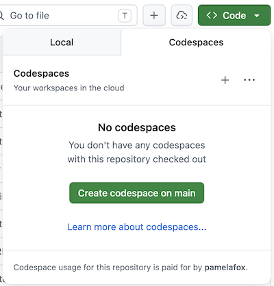

# Exercise 1: Set up your environment

In this exercise, you'll set up a development environment and coding agent.

- [Step 1: Set up your development environment](#step-1-set-up-your-development-environment)
- [Step 2: Set up a coding agent](#step-2-set-up-a-coding-agent)
- [Step 3: Install the presentation skills](#step-3-install-the-presentation-skills)

---

## Step 1: Set up your development environment

Pick **one** of the options below to get the tutorial repository open and ready.

### Option A: GitHub Codespaces

Everything is pre-configured — no local installs needed. You just need a [GitHub account](https://github.com/).

1. Login to your GitHub account.
2. Go to [github.com/pamelafox/ai-powered-presentation-workflow](https://github.com/pamelafox/ai-powered-presentation-workflow).
3. Click **Code → Codespaces → Create codespace on main**.

   

4. Wait for the Codespace to build. Once the editor loads, you're ready to move on to [Step 2](#step-2-set-up-a-coding-agent).

### Option B: VS Code

**Prerequisites:**

- [VS Code](https://code.visualstudio.com/) installed

**Steps:**

1. Clone the repository:

   ```bash
   git clone https://github.com/pamelafox/ai-powered-presentation-workflow
   ```

2. Open the folder in VS Code:

   ```bash
   code ai-powered-presentation-workflow
   ```

3. Once the editor loads, you're ready to move on to [Step 2](#step-2-set-up-a-coding-agent).

### Option C: Local environment

If you are going to use a coding agent besides VS Code GitHub Copilot, then you can set up the project in a different IDE.

**Steps:**

1. Clone (or download) the repository:

   ```bash
   git clone https://github.com/pamelafox/ai-powered-presentation-workflow
   ```

2. Open the folder in your editor of choice.
3. Once the editor loads, you're ready to move on to [Step 2](#step-2-set-up-a-coding-agent).

---

## Step 2: Set up a coding agent

Set up **one** of the coding agents from instructions below, either [GitHub Copilot in VS Code / Codespaces](#option-a-github-copilot-in-vs-code--codespaces), [GitHub Copilot CLI](#option-b-github-copilot-cli), or [Claude Code](#option-c-claude-code). You are welcome to use another coding agent if you have one installed, as long as it supports agent skills.

### Option A: GitHub Copilot in VS Code / Codespaces

1. Check the right side of VS Code to see if the Copilot Chat side panel is already open. If it's not open, find the "Toggle Chat" icon at the top of VS Code, locate and click it to open the side panel.

   

   > 🪧 **Note:** If this is your first time using GitHub Copilot, you will need to accept the usage terms to continue.

2. Make sure the chat is in **Agent** mode. (You may not see "Agent", but you should see a loop icon which says "Agent" upon clicking.)

   

3. Send a test message "Hello" to confirm the agent is working.

### Option B: GitHub Copilot CLI

> You need a [GitHub Copilot subscription](https://github.com/features/copilot) for this option.

1. Install GitHub Copilot CLI by following the [installation guide](https://docs.github.com/en/copilot/how-tos/copilot-cli/set-up-copilot-cli/install-copilot-cli).
2. Start up the Copilot CLI:

   ```bash
   copilot
   ```

3. Send a test message "Hello" to confirm the agent is working.

### Option C: Claude Code

> You need a [Claude Code](https://code.claude.com/) subscription for this option. For more details on MCP in Claude Code, see the [Claude Code MCP docs](https://code.claude.com/docs/en/mcp).

1. Install Claude Code by following the [installation guide](https://code.claude.com/docs/en/overview).
2. Start up the Claude Code CLI:

   ```bash
   claude
   ```

3. Send a test message "Hello" to confirm the agent is working.

---

## Step 3: Install the presentation skills

The [pamelafox/presentation-skills](https://github.com/pamelafox/presentation-skills) repository contains reusable agent skills for presentation workflows, including skills for creating RevealJS decks, reviewing presentation content, extracting slide text, fetching transcripts, and generating write-ups.

Open a terminal and run:

```bash
npx skills add pamelafox/presentation-skills
```

That installs the full presentation skill collection.

If you only want the skills used in the first hands-on deck exercise, you can install those individually instead:

```bash
npx skills add pamelafox/presentation-skills/make-revealjs-presentation
npx skills add pamelafox/presentation-skills/review-presentation
```

If your coding agent does not seem to discover the skills after installation, reload VS Code or restart your coding agent.

Ask your agent:

```text
What presentation-related agent skills are available to you? Do you see a skill for making RevealJS presentations and a skill for generating write-ups?
```

Once the agent confirms the skills are available, you're ready for [Exercise 2](exercise2.md).